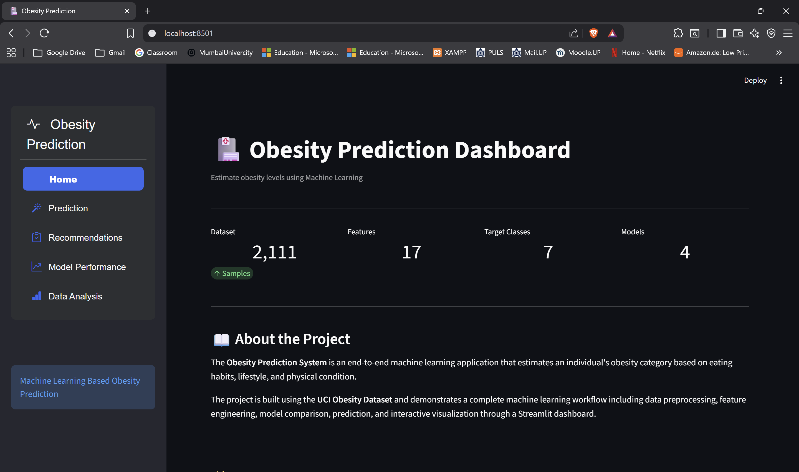
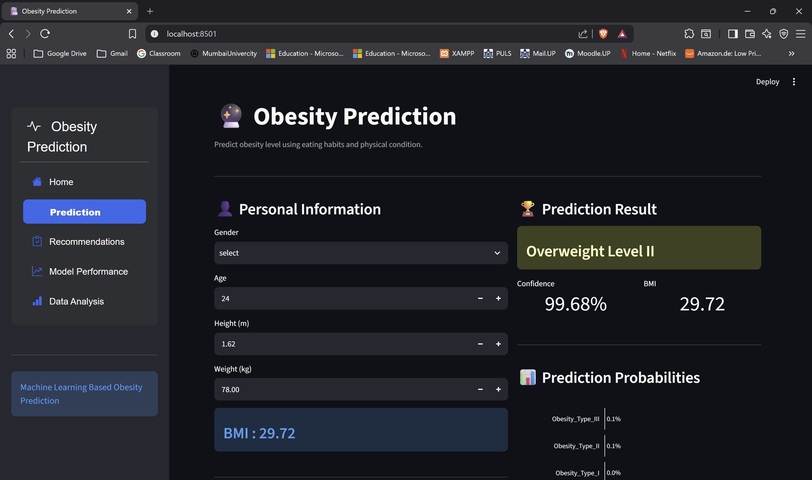
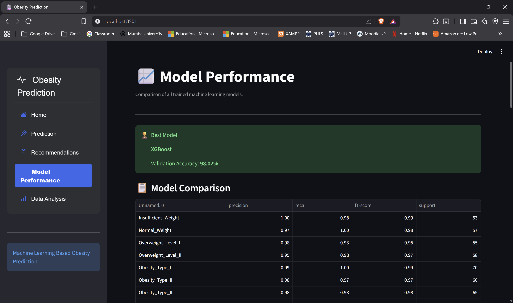
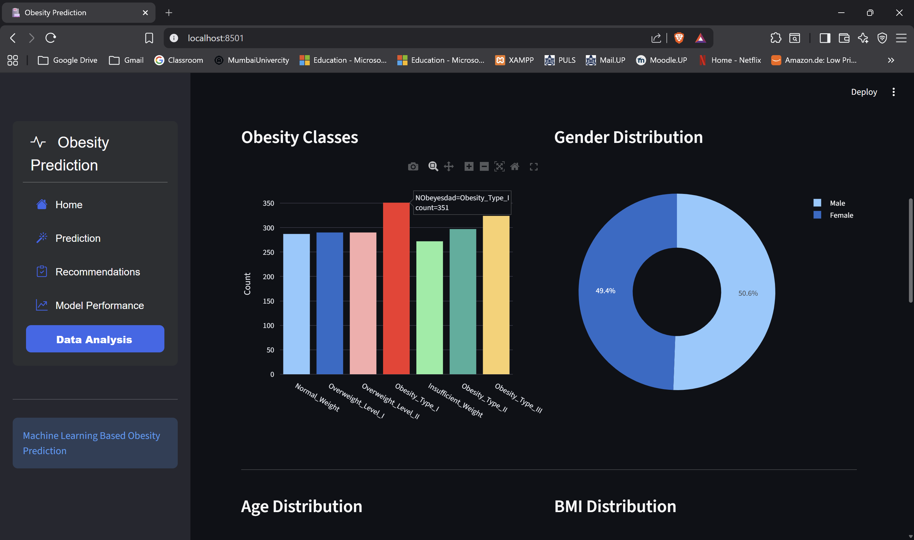

# 🏥 Obesity Prediction System

An end-to-end **Machine Learning** application that predicts an individual's obesity level based on eating habits, lifestyle characteristics, and physical condition. The project includes data preprocessing, model training, evaluation, and an interactive **Streamlit dashboard** for real-time predictions.


---

## 📌 Project Overview

Obesity has become one of the most significant public health challenges worldwide. This project leverages **Machine Learning** to estimate obesity levels using demographic information, eating habits, and physical activity patterns.

The application provides:

- 📊 Exploratory Data Analysis (EDA)
- 🤖 Machine Learning model training & comparison
- 📈 Model performance visualization
- ❤️ Real-time obesity prediction
- 🥗 Personalized health recommendations

---

## 🚀 Features

- Data preprocessing and feature engineering
- BMI calculation
- Multiple Machine Learning models
  - Logistic Regression
  - Decision Tree
  - Random Forest
  - XGBoost
- Cross-validation for model selection
- Model evaluation using:
  - Accuracy
  - Precision
  - Recall
  - F1-Score
- Interactive Streamlit dashboard
- Prediction confidence visualization
- Personalized health recommendations

---

## 📂 Project Structure

```text
Obesity-Prediction/
│
├── app/
│   ├── app.py
│   ├── views/
│   │   ├── home.py
│   │   ├── analysis.py
│   │   ├── performance.py
│   │   ├── prediction.py
│   │   └── recommendations.py
│   └── assets/
│       └── styles.css
│
├── data/
│   ├── raw/
│   └── processed/
│
├── models/
│   └── obesity_pipeline.pkl
│
├── reports/
│   ├── classification_report.csv
│   ├── feature_importance.csv
│   └── model_metrics.csv
│
├── src/
│   ├── config.py
│   ├── data_preprocessing.py
│   ├── evaluator.py
│   ├── predict.py
│   ├── train_model.py
│   └── utils.py
│
├── requirements.txt
├── README.md
└── .gitignore
```

---

## 📊 Dataset

**Dataset:** Estimation of Obesity Levels Based on Eating Habits and Physical Condition

- Source: UCI Machine Learning Repository
- Records: **2,111**
- Features: **17**
- Target Classes: **7**

Target classes:

- Insufficient Weight
- Normal Weight
- Overweight Level I
- Overweight Level II
- Obesity Type I
- Obesity Type II
- Obesity Type III

---

## 🛠️ Technology Stack

| Category | Technologies |
|----------|--------------|
| Programming | Python |
| Machine Learning | Scikit-Learn, XGBoost |
| Data Analysis | Pandas, NumPy |
| Visualization | Plotly |
| Web Framework | Streamlit |
| Model Serialization | Joblib |

---

## ⚙️ Installation

### 1. Clone the repository

```bash
git clone https://github.com/SudarshanTarmale/obesity_prediction.git
cd Obesity-Prediction
```

### 2. Create a virtual environment

```bash
python -m venv .venv
```

### Windows

```bash
.venv\Scripts\activate
```

### macOS/Linux

```bash
source .venv/bin/activate
```

### 3. Install dependencies

```bash
pip install -r requirements.txt
```

---

## ▶️ Running the Project

### Step 1 — Preprocess the dataset

```bash
python -m src.data_preprocessing
```

### Step 2 — Train the models

```bash
python -m src.train_model
```

### Step 3 — Launch the Streamlit application

```bash
streamlit run app/app.py
```

---

## 🤖 Machine Learning Pipeline

```text
Raw Dataset
      │
      ▼
Data Preprocessing
      │
      ▼
Feature Engineering (BMI)
      │
      ▼
Train/Test Split
      │
      ▼
ColumnTransformer
      │
      ▼
Machine Learning Models
      │
      ▼
Model Evaluation
      │
      ▼
Best Pipeline
      │
      ▼
Real-Time Prediction
```

---

## 📈 Model Evaluation

The application compares multiple classification algorithms and automatically selects the best-performing model based on **5-Fold Cross Validation**.

Evaluation metrics include:

- Accuracy
- Precision
- Recall
- F1-Score
- Classification Report
- Feature Importance

Generated reports are stored in the `reports/` directory.

---

## 🖥️ Dashboard

The Streamlit dashboard includes the following sections:

- 🏠 Home
- 📊 Data Analysis
- 📈 Model Performance
- ❤️ Prediction
- 🥗 Recommendations

---

## 📷 Screenshots

Add screenshots of your application here after deployment.

Example:

```text
README/
│
├── home.png
├── prediction.png
├── performance.png
└── analysis.png

```

Then include:

```markdown
### Home



### Prediction



### Model Performance



### Data Analysis


```

---

## 📌 Future Improvements

- Hyperparameter tuning using GridSearchCV
- Model explainability with SHAP
- User authentication
- Cloud deployment
- Docker support
- REST API integration

---

## 📚 References

- UCI Machine Learning Repository – Estimation of Obesity Levels Based on Eating Habits and Physical Condition
- Scikit-Learn Documentation
- XGBoost Documentation
- Streamlit Documentation
- Plotly Documentation

---

## 👨‍💻 Author

**Sudarshan**

Master's Student – Data Science / Machine Learning

GitHub: https://github.com/SudarshanTarmale

LinkedIn: https://www.linkedin.com/in/sudarshan-tarmale/

---

## 📄 License

This project is licensed under the MIT License.